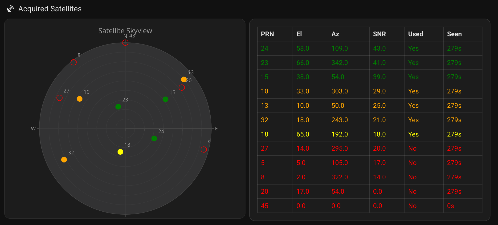

# NTP-GPS-PPS-MQTT-HA

Home Assistant status dashboard for a GPS/PPS-disciplined NTP server running on a Raspberry Pi.

## Overview

A collection of Python bridge scripts that read live data from a GPS receiver, NTP daemon, and system health metrics — then publish everything to Home Assistant via MQTT with full auto-discovery.



## Architecture

```
RPi: GPSD   → gpsd_monitor.py    → MQTT → HA device: "GPS Monitor"
RPi: psutil → system_monitor.py  → MQTT → HA device: "RPi System Monitor"
RPi: ntpq   → ntpd_monitor.py    → MQTT → HA device: "NTP Monitor"
```

## Scripts

| Script | Purpose | Runs on |
|--------|---------|---------|
| `gpsd_monitor.py` | GPSD → MQTT bridge with HA auto-discovery | RPi (systemd) |
| `system_monitor.py` | System health → MQTT bridge with HA auto-discovery | RPi (systemd) |
| `ntpd_monitor.py` | NTPd status → MQTT bridge with HA auto-discovery | RPi (systemd) |

## Infrastructure

| Component | Details |
|-----------|---------|
| GPS Server | RPi hostname `<your-hostname>`, Raspbian |
| GPS Device | `/dev/ttyAMA0` (MTK-3301, GPS-only) |
| GPSD Version | 3.27.5 |
| MQTT Broker | Home Assistant at `<your-ha-host>:8883` (TLS) |

## Requirements

- Python 3.6+
- `gps_monitor.py` — no external dependencies (standard library only)
- `gpsd_monitor.py`, `system_monitor.py`, `ntpd_monitor.py` — require `paho-mqtt` and `psutil`

## Usage

### Terminal Monitor (Mac / dev)

```bash
./gps_monitor.py                  # default host localhost
./gps_monitor.py 192.168.x.x      # custom host
```

### RPi Services

The three MQTT bridge scripts run as systemd services on the RPi. Copy and fill in credentials first:

```bash
sudo cp gpsd_monitor.conf.example /etc/monitoring/gpsd_monitor.conf
sudo cp system_monitor.conf.example /etc/monitoring/system_monitor.conf
sudo cp ntpd_monitor.conf.example /etc/monitoring/ntpd_monitor.conf
sudo chmod 600 /etc/monitoring/*.conf
```

Each service uses this unit file pattern (save to `/etc/systemd/system/<service-name>.service`):

```ini
[Unit]
Description=<description>
After=network.target
# Also add: gpsd.service — for gps-monitor.service only

[Service]
EnvironmentFile=/etc/monitoring/<service>.conf
ExecStart=/usr/bin/python3 /etc/monitoring/<script>.py
Restart=on-failure
RestartSec=5
User=pi

[Install]
WantedBy=multi-user.target
```

Enable and start each service:

```bash
sudo systemctl daemon-reload
sudo systemctl enable gps-monitor.service system-monitor.service ntp-monitor.service
sudo systemctl start gps-monitor.service system-monitor.service ntp-monitor.service
```

Check status:

```bash
sudo systemctl status gps-monitor.service
journalctl -u gps-monitor.service -f
```

## Configuration

MQTT publish groups in `gpsd_monitor.py` align with GPSD message classes. Each group can be toggled and rate-limited independently:

| Variable | Default | Description |
|----------|---------|-------------|
| `GPS_PUBLISH_VERSION` | `true` | GPSD version and protocol |
| `GPS_PUBLISH_VERSION_INTERVAL` | `0` | Publish interval in seconds (0 = every message) |
| `GPS_PUBLISH_SKY` | `true` | Satellite data and all DOPs |
| `GPS_PUBLISH_SKY_INTERVAL` | `0` | Publish interval in seconds |
| `GPS_PUBLISH_TPV` | `true` | Fix, position, speed, errors |
| `GPS_PUBLISH_TPV_INTERVAL` | `0` | Publish interval in seconds |
| `GPS_PUBLISH_TOFF` | `true` | Serial time offset (GPS vs system clock) |
| `GPS_PUBLISH_TOFF_INTERVAL` | `0` | Publish interval in seconds |
| `GPS_PUBLISH_PPS` | `true` | PPS pulse timing data |
| `GPS_PUBLISH_PPS_INTERVAL` | `0` | Publish interval in seconds |

See `gpsd_monitor.conf.example` for all available options.

### system_monitor.py

| Variable | Default | Description |
|----------|---------|-------------|
| `SYSTEM_PUBLISH_INTERVAL` | `30` | Seconds between publishes |
| `MQTT_BROKER` | *(required)* | MQTT broker hostname |
| `MQTT_PORT` | `8883` | MQTT broker port |
| `MQTT_USERNAME` | *(required)* | MQTT username |
| `MQTT_PASSWORD` | *(required)* | MQTT password |
| `MQTT_TLS` | `true` | Enable TLS (`false` to disable) |
| `MQTT_CA_CERT` | *(empty)* | Path to CA cert file; empty = system trust store |

See `system_monitor.conf.example` for a template.

### ntpd_monitor.py

| Variable | Default | Description |
|----------|---------|-------------|
| `NTP_PUBLISH_INTERVAL` | `30` | Seconds between publishes |
| `MQTT_BROKER` | *(required)* | MQTT broker hostname |
| `MQTT_PORT` | `8883` | MQTT broker port |
| `MQTT_USERNAME` | *(required)* | MQTT username |
| `MQTT_PASSWORD` | *(required)* | MQTT password |
| `MQTT_TLS` | `true` | Enable TLS (`false` to disable) |
| `MQTT_CA_CERT` | *(empty)* | Path to CA cert file; empty = system trust store |

See `ntpd_monitor.conf.example` for a template.

## MQTT Topics

| Topic | Source | Content |
|-------|--------|---------|
| `gps_monitor/version` | VERSION | GPSD release, protocol version |
| `gps_monitor/sky` | SKY | Satellites, DOPs (HDOP/VDOP/PDOP/etc.) |
| `gps_monitor/tpv` | TPV | Fix mode, position, speed, track, errors |
| `gps_monitor/toff` | TOFF | Serial latency offset, raw clock fields |
| `gps_monitor/pps` | PPS | PPS timing offset, precision, SHM segment |
| `gps_monitor/availability` | bridge | `online` / `offline` |
| `system_monitor/state` | system_monitor.py | CPU%, CPU temp, memory% + detail (MB), swap% + detail (MB), disk% + detail (GB), load avg, uptime, RTC time/date/battery |
| `system_monitor/availability` | bridge | `online` / `offline` |
| `ntp_monitor/state` | ntpd_monitor.py | NTP sync, stratum, offset, jitter |
| `ntp_monitor/availability` | bridge | `online` / `offline` |

## Testing

```bash
python3 -m pytest tests/ -v
```

## AI Usage

A majority of this repository was generated with Claude Code as an experiment in agent-based coding workflows.

## License

This project is licensed under the [GNU General Public License v3.0](LICENSE).
